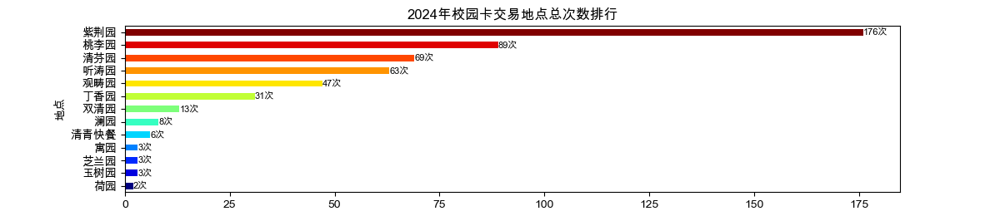
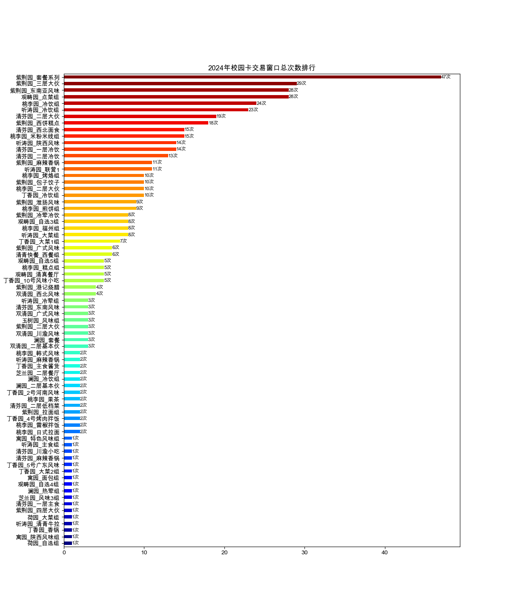
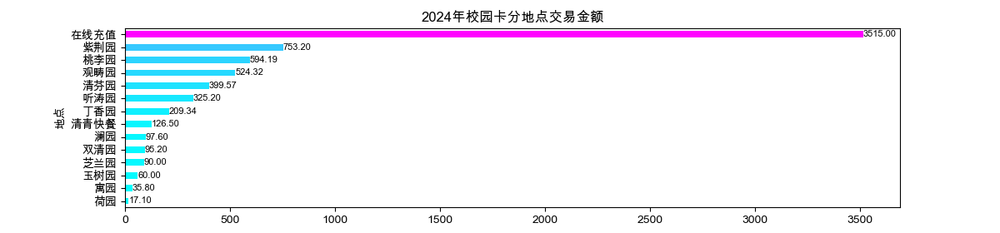
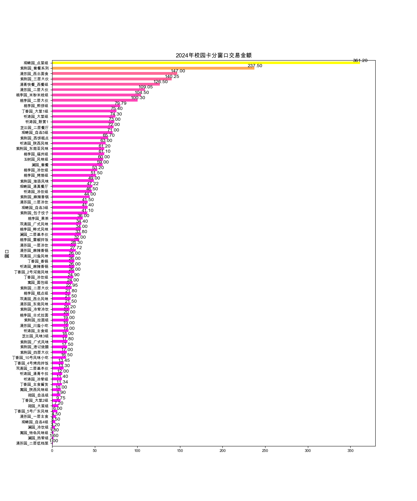
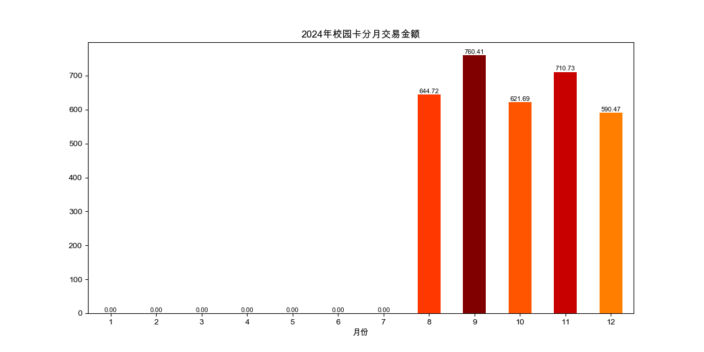
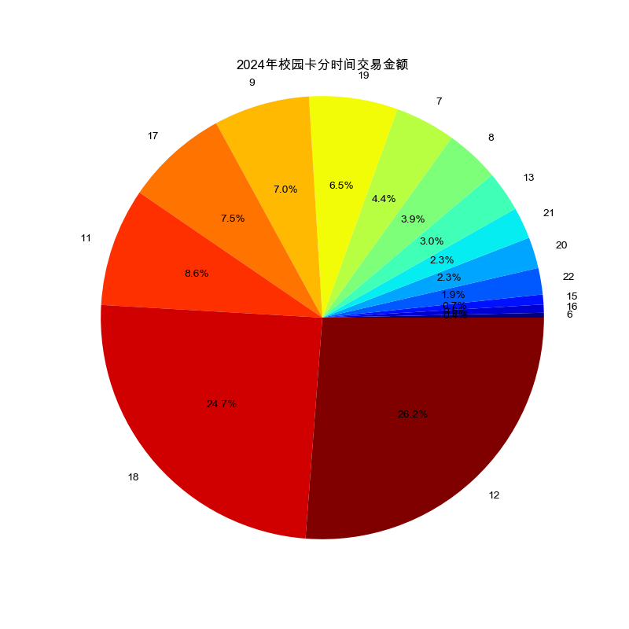
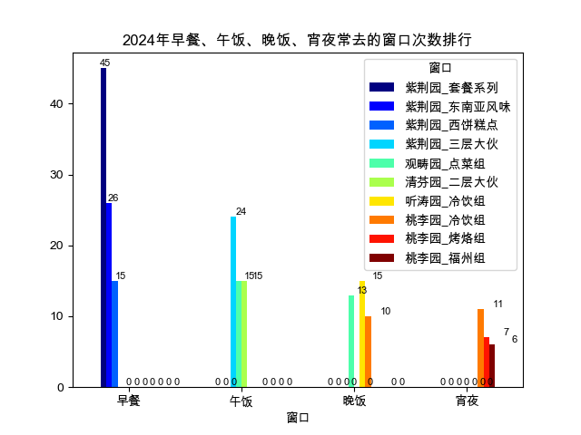
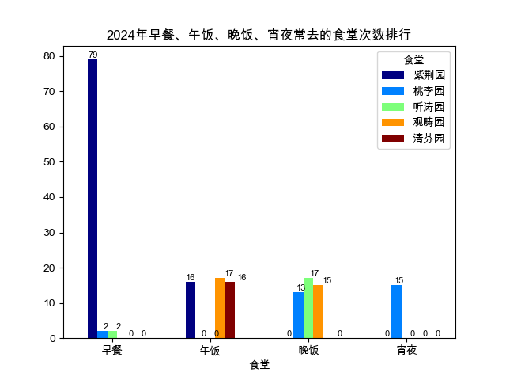

# 华清大学2024年校园卡年度总结

## 0.申明

> 项目数据获取主体框架来源于[Ze-en Xiong](https://github.com/leverimmy)。

> 项目的 idea 来源于 [Rose-max111](https://github.com/Rose-max111)。

> 项目数据获取方式可见[数据获取](https://github.com/leverimmy/THU-Annual-Eat)。

> 项目的数据分析与展示制作由本人[Zang Lee](https://github.com/MrZang27)完成。
    

## 1.总览

2024年， **王旭** 在华清大学校园卡上共消费 **3328.02** 元， **2024年513次** 交易成功，

其中最常去的食堂是 **紫荆园** ，共消费 **753.2** 元， **2024年共176次** 到访；

最常去的窗口是 **紫荆园_套餐系列** ，共消费 **237.5** 元， **2024年共47次** 到访。

 

 

累计消费最多的食堂是 **紫荆园** ，共消费 **753.2** 元；

累计消费最多的窗口是 **观畴园_点菜组** ，共消费 **361.2** 元。

 

 

在 **2024年9月16日17时33分35秒** 时，你为了 **观畴园_点菜组** 进行了2024年最大的一笔消费，花了 **44.3** 元；

在 **2024年12月10日9时32分26秒** 时，你为了 **紫荆园_东南亚风味** 进行了2024年最小的一笔消费，花了 **0.4** 元。

你2024年平均每次刷校园卡花费 **6.49** 元。

还记得 **2024年9月** 发生了什么吗，你在这个月消费最多，共消费了 **760.41** 元；

一个月的时间太长，那你还记得 **2024年8月25日** 发生了什么吗，你在这一天消费最多，共消费了 **116.92** 元。

另外 **2024年1月** 是不是已经放假回家，你在这个月只消费了 **0.0** 元。
    
同时，你在有消费的日子中 **2024年11月28日** 消费最少，只花了 **4.0** 元。

 

2024年，你每天最喜欢在 **2024年12时** 时刷卡，共消费了 **872.43** 元；

你在 **2024年6时** 时刷卡最少，只花了 **11.7** 元。

 

    
你这一年里一共去过 **13**个食堂，**72**个窗口。

这些食堂分别是 **['桃李园', '紫荆园', '玉树园', '双清园', '澜园', '观畴园', '听涛园', '清芬园', '清青快餐', '丁香园', '芝兰园', '寓园', '荷园']** 

去过如此之多的食堂，堪称华清干饭王！ 

## 2.早餐

2024年，你在华清大学共吃了 **87** 顿早餐，共花费 **522.4** 元。

生活虽忙，也要记得好好吃早餐！

还记得 **2024年9月20日6时35分47秒** 的时候，你在 **桃李园_烤烙组** 吃早餐，花了 **4.7** 元，这是你2024年吃得最早的一餐；

当然，也别忘了 **2024年12月11日9时46分11秒** 的时候，你在 **紫荆园_东南亚风味** 吃早餐，花了 **1.0** 元，虽然晚起了一会，但是也坚持去吃了早餐。

2024年，你最喜欢去 **紫荆园** 吃早餐， **2024年共79次** 在这里吃了早餐，共花费了 **478.2** 元；

**紫荆园_套餐系列** 是你早餐的最爱， **2024年共45次** 在这里点了早餐，共花费了 **223.5** 元。

## 3.午饭

2024年，你在华清大学共吃了 **87** 顿午饭，共花费 **1258.5** 元。

    
还记得 **2024年9月15日11时10分50秒** 的时候就已经点好了 **双清园_广式风味** ，这顿午饭花了 **15.7** 元,这是你2024年午餐吃得最早的一次；

另外，在 **2024年9月3日13时33分26秒** 的时候才去吃午饭，吃的是 **清青快餐_西餐组** ，花了 **20.0** 元

2024年，你最喜欢去 **观畴园** 吃午饭， **2024年共17次** 在这里吃了午饭，共花费了 **281.87** 元；

**紫荆园_三层大伙** 是你午餐的最爱， **2024年共24次** 在这里点了午餐，共花费了 **96.75** 元。

    

## 4.晚饭

2024年，你在华清大学共吃了 **84** 顿晚饭，共花费 **1306.51** 元。

从来不吃晚饭？看来你就是华清大学外卖专业户！

## 5.宵夜

2024年，你在华清大学共吃了 **15** 顿宵夜，共花费 **216.61** 元。

从来不吃宵夜？你是如何忍住深夜美食诱惑的！

## 6.吃饭总览

2024年，你在华清大学共吃了 **87** 顿早餐，共花费 **522.4** 元；

吃了 **87** 顿午饭，共花费 **1258.5** 元；

吃了 **84** 顿晚饭，共花费 **1306.51** 元；

吃了 **15** 顿宵夜，共花费 **216.61** 元。

一日四餐最爱去的食堂分别是 **紫荆园** 、 **观畴园** 、 **听涛园** 和 **桃李园** ；

 

 

## 8.其它

